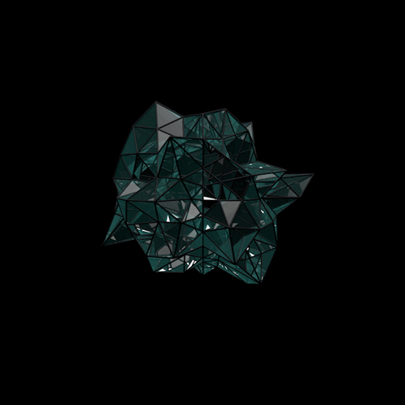

<table>
<tr>
<td width="40%" valign="top">

<h2>About Me</h2>

I am Faruk GÜLER, an IT server and virtualization administrator. With 11 years of professional experience and accreditation, I am a dedicated and enthusiastic information technology and cybersecurity researcher. I conduct research and studies on the IT world, hacking and security, artificial intelligence, blockchain projects and cryptocurrencies, open-source technologies, and Linux. I also own the blog "farukguler.com," where I write about various technologies and services. I have been actively maintaining this blog since 2021.

<h2>My Focus</h2>
Linux • Windows Server • VMware ESXI • NSX-T • Active Directory • Ansible • Kubernetes • Docker • Podman • OpenShift • Hyper-V • Proxmox • Prometheus • Zabbix • PostgreSQL • Security • Hardening • Networking • Storage • Azure • Office365 • Veeam • PowerShell & Bash • Microsoft Entra ID

</td>
<td width="40%" align="center" valign="top">

</td>
</tr>
</table>

<h2 align="left">Skills</h2>

